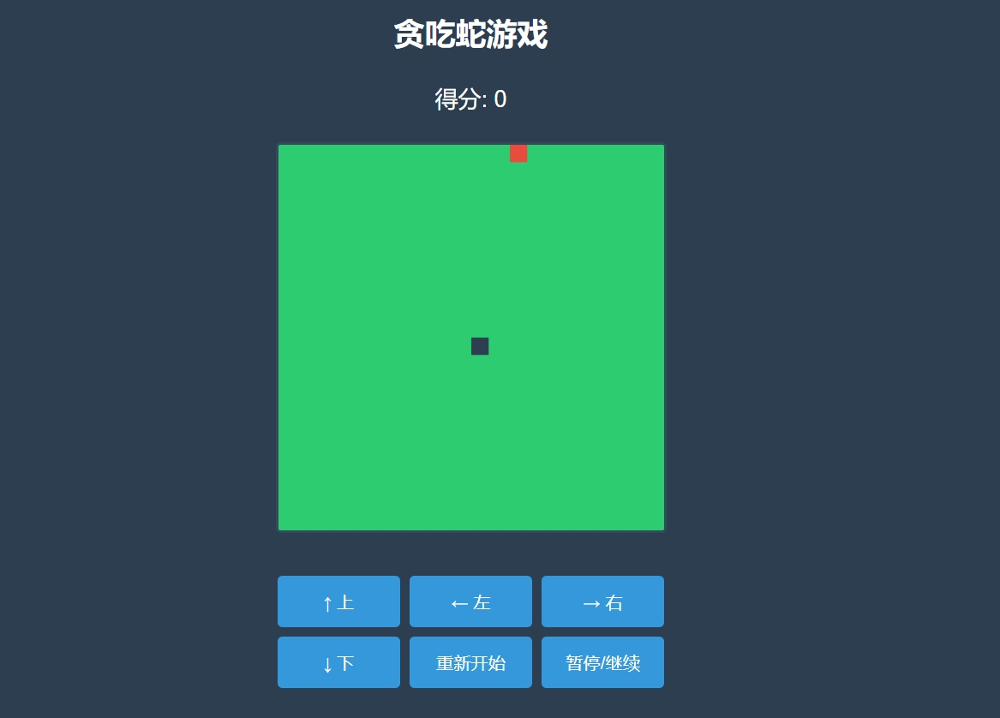

# 🐍 遥控贪吃蛇游戏

[](https://github.com/yourusername/snake-game/blob/main/LICENSE)


一个基于HTML5 Canvas开发的响应式贪吃蛇游戏，支持跨平台操作（PC/移动端），包含完整游戏逻辑和现代UI设计。



## 功能特性

### 🎮 游戏功能
- 双控制模式：键盘方向键 / 触摸按钮
- 实时计分系统
- 碰撞检测（边界 & 自碰撞）
- 智能食物生成算法
- 暂停/继续功能
- 游戏重置功能

### 🖥️ 技术特性
- 基于HTML5 Canvas渲染
- 响应式布局设计
- 移动优先的UI组件
- 60FPS流畅动画
- 防误触方向控制
- 模块化代码结构

## 🚀 快速开始
### 在线体验
[点击这里体验在线Demo](https://2100chen.github.io/snake---eating/)


### 本地运行
```bash
git clone https://github.com/2100chen/snake---eating.git
cd snake---eating
./index.html
# 或直接打开index.html即可
```

## 🕹️ 操作说明
| 平台      | 控制方式                          |
|-----------|---------------------------------|
| PC        | 键盘方向键 (← ↑ → ↓)            |
| 移动设备  | 点击屏幕控制按钮                  |
| 所有平台  | 暂停/继续按钮 · 重新开始按钮      |

## ⚙️ 技术架构


## 🔧 自定义配置
在`script`标签中修改以下常量：
```javascript
const gridSize = 20;        // 网格像素尺寸
const tileCount = 20;       // 游戏区域网格数量 (n x n)
const gameSpeed = 100;      // 游戏刷新间隔(ms)
```

## 📂 项目结构
```
snake-game/
├── index.html          # 主程序文件
├── README.md           # 项目文档
├── LICENSE             # 许可证文件
└── assets/             # 资源目录（可选）
    ├── screenshots/    # 截图
    └── sounds/         # 音效文件（可扩展）
```

## 📌 待实现功能
- [ ] 音效系统
- [ ] 难度等级选择
- [ ] 排行榜功能
- [ ] 食物特效（加速/减速）

## 📄 开源协议
本项目采用 [MIT License](LICENSE) 授权，欢迎自由使用和二次开发。
